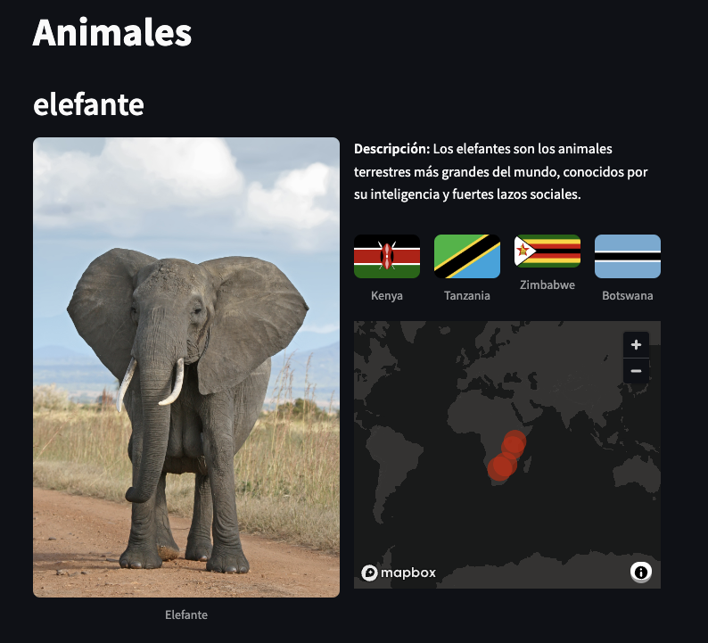

# Interfaz

En esta parte, vamos a aprender cómo crear una aplicación simple usando Streamlit para mostrar información sobre animales tal y como podemos ver en la fotografía:  
  
Para ello, rellenaremos el archivo `streamlit_app.py`.  
Aquí te explicamos paso a paso cómo hacerlo:

1. **Importar las bibliotecas necesarias**  
   En primer lugar, importaremos la libreria `streamlit` para usar sus componentes. Normalmente, para hacer el código más facil de leer, la importamos como `st`.

   ```python
   import streamlit as st
   ```

   En segundo lugar, importaremos el archivo `info.py` que está en la carpeta principal del repositorio. En este archivo tendremos toda la información que vamos a necesitar para los distintos ejercicios. En este caso, nos centraremos en el primer fragmento, debajo de `# Info parte 1`.

   ```python
   import info
   ```

2. **Título de la aplicación**  
   Usamos `st.title` para poner un título a nuestra aplicación. En este caso, el título es "Animales".

   ```python
   st.title("Animales")
   ```

3. **Mostrar detalles del animal**  
   Usamos `st.header` para mostrar el nombre del animal. La información del nombre viene del archivo `info`.

   ```python
   st.header(info.nombre_elefante)
   ```

4. **Crear columnas para organizar el contenido**  
   Usamos `st.columns` para crear dos columnas. En la primera columna, mostramos una imagen del animal usando `st.image`. En la segunda columna, mostramos una descripción del animal y las banderas de los países donde se encuentra el animal.

   ```python
   columna1, columna2 = st.columns(2)

   with columna1:
       # Contenido de la columna 1
   with columna2:
       # Contenido de la columna 2
   ```

5. **Columna 1**  
   En la columna 1 simplemente utilizaremos la función `st.image` para añadir una fotografía utilizando el enlace de `info.foto_elefante`.

   ```python
   ...
   with columna1:
       # Fotografía
       st.image(info.foto_elefante, caption=info.nombre_elefante.title())
   ...
   ```

6. **Columna 2**:

   1. **Descripción**  
      Para la descripción del animal, utilizaremos la función `st.write`, que nos permite utilizar `**Descripción**` para poner la palabra en negrita.

      ```python
      ...
      with columna2:
        # Descripción
        st.write(f"**Descripción:** {info.descripcion_elefante}")
        ...
      ...
      ```

   2. **Banderas**  
      Para la representación de las banderas de los distintos países, utilizaremos de nuevo columnas. En este caso, tendremos 4 columnas, una por cada país.
      En cada una de las columnas añadimos las fotografías y pie de foto de cada país ayudandonos del archivo `info`.
      En este caso, utilizamos `vertical_alignment="center"` para centrar verticalmente las fotografías de las banderas.

      ```python
      ...
      with columna2:
        ...
        # Banderas
        pais1, pais2, pais3, pais4 = st.columns(4, vertical_alignment="center")
        with pais1:
            st.image(info.bandera_kenya, caption="Kenya")
        with pais2:
            st.image(info.bandera_tanzania, caption="Tanzania")
        with pais3:
            st.image(info.bandera_zimbabwe, caption="Zimbabwe")
        with pais4:
            st.image(info.bandera_bostwana, caption="Botswana")
        ...
      ```

   3. **Mapa**  
      Utilizamos la función `st.map` y las coordenadas de `info` para crear un mapa en el que visualizar los paises donde podemos encontrar el animal.
      En este caso, utilizamos `height=300` para conseguir que la altura del mapa no sea excesivamente grande, `zoom=0` para que la vista sea prácticamente el mapamundi completo, y `size=1000000` para que los puntos en el mapa tengan un tamaño suficientemente grande como para representar visualmente un país.

      ```python
      ...
      with columna2:
        ...
        # Mapa
        st.map(info.coordenadas_elefante, use_container_width=True, height=300, zoom=0, size=1000000)
      ```

¡Y eso es todo! Ahora tienes una aplicación simple de Streamlit que muestra información sobre un animal.

---

[<- Volver](../README.md)
